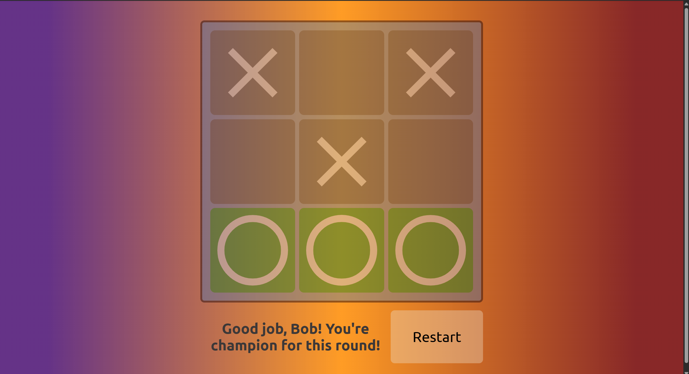

# TOP Tic Tac Toe
**Tic Tac Toe** project from [The Odin Project](https://www.theodinproject.com/about) course

## Preview link
https://yurii-ruban.github.io/top-tic-tac-toe

## Skills
 - HTML
    * Default boilerplate
    * Link external files
 - CSS
    * Flexbox layout
    * Grid layout
 - JS
    * Factory functions
    * Module pattern
    * Classes

## Purpose
The **Tic Tac Toe**'s project aim is to practice skills when working with JS `Factory functions`, `Module pattern a.k. Singletone`, `Objects`, etc.
The main task is to create simple Tic Tac Toe game for 2 players with ability to start and restart the game

## Screenshot

